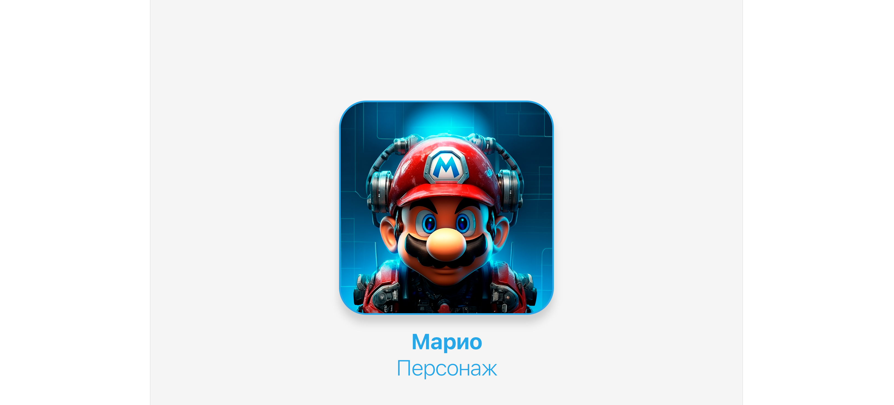

# Курсовой проект

Контекст
В 2018 году Джеймс Клир написал книгу «Атомные привычки»,
которая посвящена приобретению новых полезных привычек и
искоренению старых плохих привычек. 

Данное приложение создано для отправки напоминаний 
пользователям об их привычках.
Приложение позволяет пользователю создавать привычки и получать 
напоминание в мессенджере Telegram о необходимости выполнения

# Работа с проектом
Настройки проекта:
1. Активировать виртуальное окружение venv/bin/activate.bat 
2. Установить в зависимости от проекта, ответив в файле
requirements.txt pip install -r requirements.txt
3. Установка и запуск Redis 
4. Создать базу данных в PostreSQL CREATE DATABASE kurs_7
5. Применить миграцию 
6. Запустить сервер python manage.py runserver 
7. Запустить Celery 
celery -A config worker -l INFO celery -A config Beat -l info -S django

Модели 
В книге хороший пример привычки описывается как конкретное действие, 
которое можно уложить в одно предложение:я буду 
[ДЕЙСТВИЕ] в [ВРЕМЯ] в [МЕСТО]

За каждую полезную привычку необходимо себя вознаграждать или сразу после делать приятную привычку.
Но при этом привычка не должна расходовать на выполнение больше 2 минут.

Валидация Исключены одновременный выбор связанной привычки и указания вознаграждения. 
Время выполнения должно быть не больше 120 секунд. В связанные привычки могут попадать 
только привычки с признаком приятной привычки. У приятной привычки не может быть вознаграждения или 
связанной привычки. Нельзя выполнять привычку реже, чем 1 раз в 7 дней.

Права доступа Каждый пользователь имеет доступ только к своим привычкам по механизму CRUD. 
Пользователь может видеть список публичных привычек без возможности их как-то редактировать или удалять.

Отложенные задачи Для полноценной работы сервиса реализована работа с отложенными 
задачами для напоминания о том, в какое время какие привычки необходимо выполнять.

Для этого сделана интеграция сервиса с мессенджером Telegram, который будет заниматься рассылкой уведомлений.

Безопасность Для проекта настроен CORS, чтобы фронтенд мог подключаться к проекту на развернутом сервере.
Пользователю после регистрации необходимо заполнить в своем профиле поле
'telegram_username', написать боту любое сообщение и перейти по ссылке 
localhost:8000/user/get_chat_id/pk, где pk - id пользователя. 
Это необходимо для получения id чата пользователя с ботом для дальнейшей
возможности отправлять пользователю сообщения.

После создания пользователем полезной привычки будет создана периодическая задача, 
результатом выполнения которой будет отправка сообщения в телеграм в заданное
пользователем время с заданной периодичностью